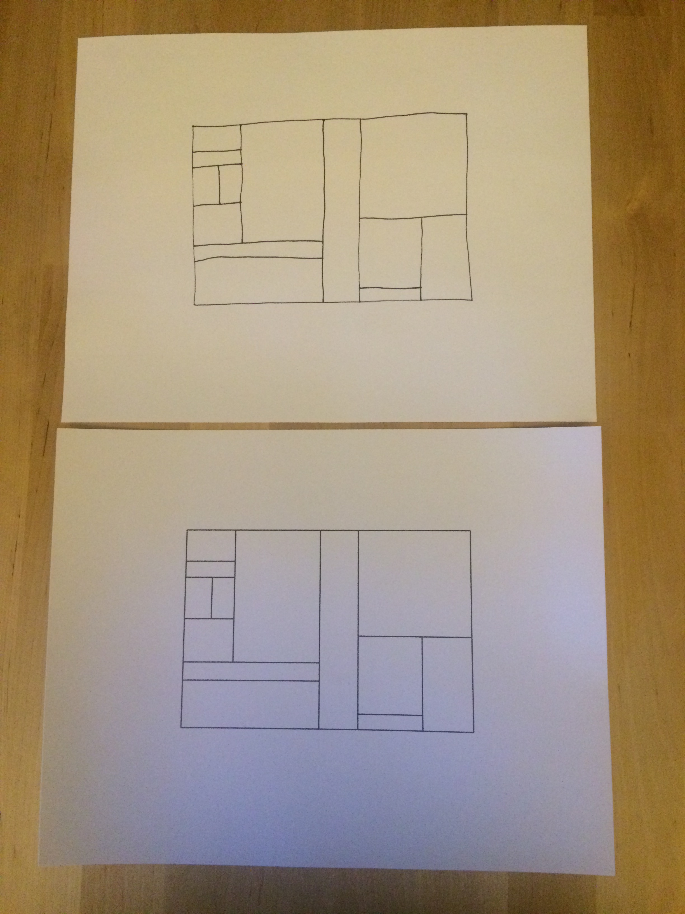

# Dynamic Drafting Paper

# Dependencies

Python libraries to install:

* cv2
* numpy
* scipy
* scikit-image
* networkx
* cairosvg
    * cairo: brew install cairo

For printing:

* lpr

For camera server:

* gphoto2
* websocket-client

(TODO: Make sure this list is complete.)

# Usage

Run a pipeline with, e.g.

    python ddp extract_paper

Check out `ddp/__main__.py` for command line options.

# Code Organization

`camera_server/`. Code that runs on the computer with the camera. Creates a web server that one can query for the current picture. (TODO)

`ddp/`. The codebase for doing *dynamic drafting paper* (ddp).

`ddp/core/`. All the core logic. A bunch of functions for processing images, graphs, constraint networks, etc.

`ddp/infrastructure/`. Code for interfacing with the outside world.

`ddp/pipeline/`. Pipelines for performing particular tasks. These chain together the functions from `ddp/core/`.

`ddp/__main__.py`. This is the "runner" that runs pipelines in various ways.

`input/`. Sample input images and data for running through pipelines.

`log/`. Images and data from a pipeline run will be written here when a pipeline is run with file logging.

# Pipelines

Each pipeline module must contain at least these two functions:

1. `run(input_data)`. The main pipeline function. Should make copious calls to `infrastructure.log`.

2. `sample()`. Returns a sample input that can be run through the pipeline. That is, `run(sample())` should be a typical run for the pipeline.

## Logging

In order to visualize pipeline execution, pipeline `run` functions should make calls to `infrastructure.log.image(...)`.

If the runner is in file mode, calls to `log` will output files to the `log/` directory. In watch mode, calls to `log.image(...)` will show logged images in a window (TODO).
